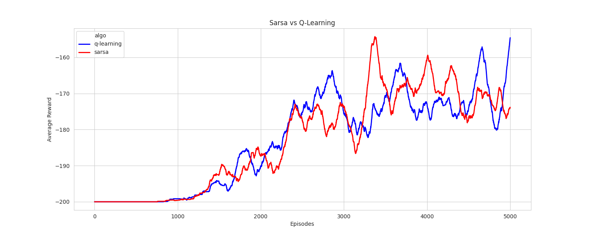
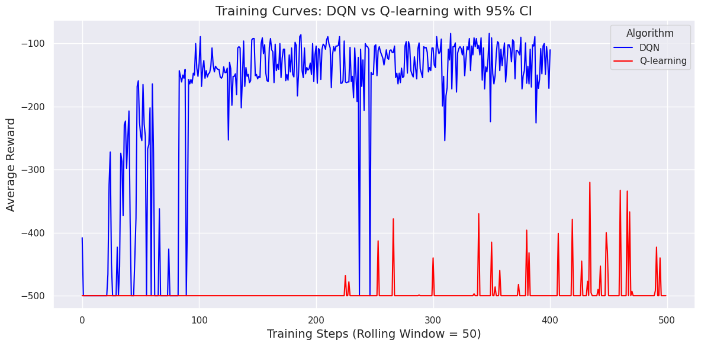
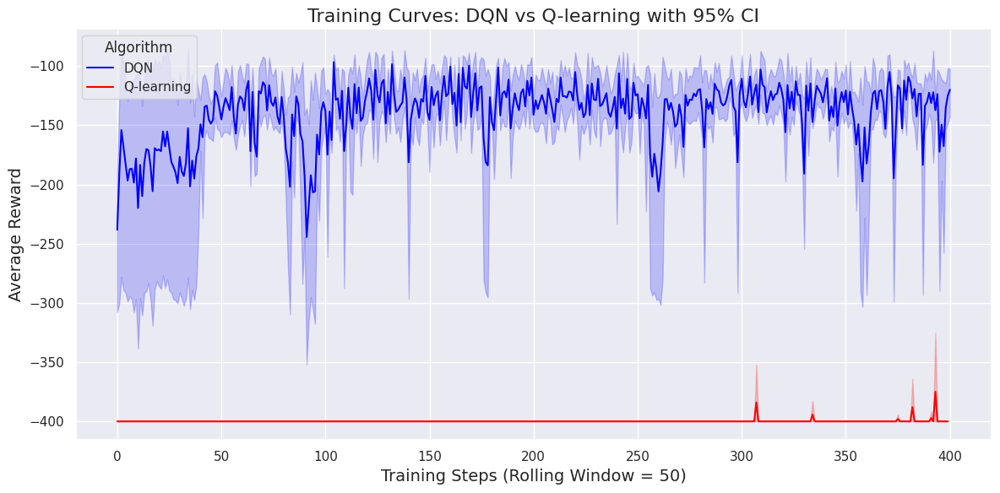
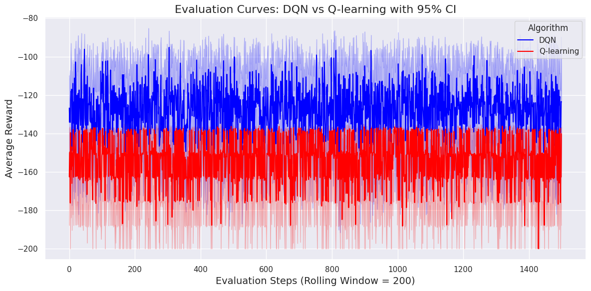

# Mountain Car environment

### Q-Learning vs Sarsa
#### N runs = 5

     

### Training DQN vs Q-learning 400 episodes:
#### N run = 1

     

#### N runs = 5

     

### Evaluation

#### Q-learn trained with 5000 episodes vs DQN trained with 400 episodes
##### N runs = 5

     

